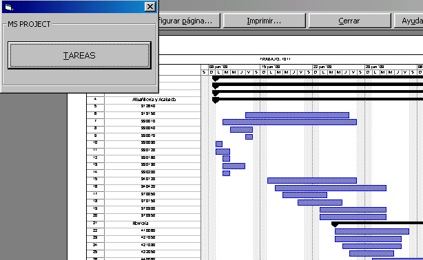



## MS Project with Access

### Description

Generate tasks in MS Project from a data base in Access.
 
### More Info
 

             |
---                |---
**Submitted On**   |2003-07-11 09:01:20
**By**             |[Israel Balderrama](https://github.com/Planet-Source-Code/PSCIndex/blob/master/ByAuthor/israel-balderrama.md)
**Level**          |Beginner
**User Rating**    |5.0 (10 globes from 2 users)
**Compatibility**  |VB 6\.0, VBA MS Access
**Category**       |[Microsoft Office Apps/VBA](https://github.com/Planet-Source-Code/PSCIndex/blob/master/ByCategory/microsoft-office-apps-vba__1-42.md)
**World**          |[Visual Basic](https://github.com/Planet-Source-Code/PSCIndex/blob/master/ByWorld/visual-basic.md)
**Archive File**   |[MS\_Project1612897112003\.zip](https://github.com/Planet-Source-Code/israel-balderrama-ms-project-with-access__1-46813/archive/master.zip)

